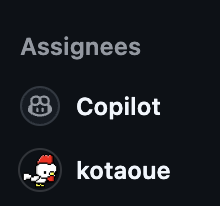
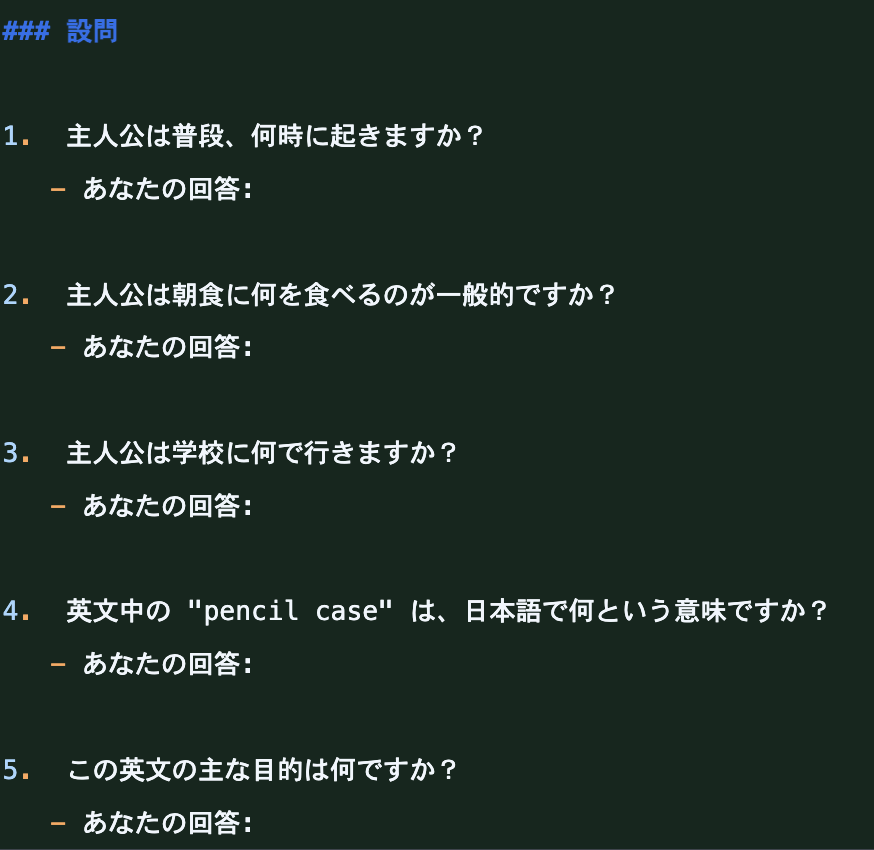
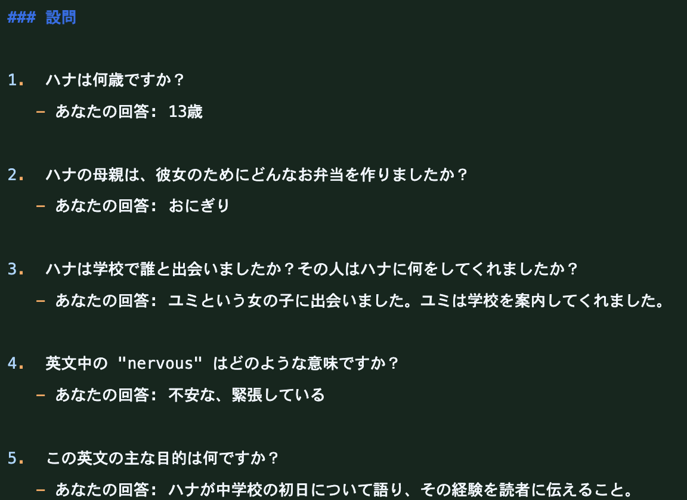

<!-- _class: title-center -->
# AIと「ハンドル握るのはどっち？」を話してたと思ってたら、全然違う話になってた件

[kotaoue](https://github.com/kotaoue)

---

## はじめに

> 「エンジニアが朝の通勤中にスマートフォンアプリのSlack経由でバグ修正や機能追加を指示すると、Claudeが作業し、完了後にSlackで返答する。エンジニアはその内容を確認し、問題なければ本番環境に統合するだけでいい」
> — [Shopifyのシニアエンジニアは12月以降1行もコードを書いてない](https://www.itmedia.co.jp/aiplus/articles/2602/13/news074.html)

- 「エンジニアリング」って言葉が示すものが変わったなー
- 個人的にはAIエージェントが登場した時よりもビックリ

---

## AIとエンジニアのこれまでの歩み

### 〜2025 = AIペアプログラミング

- エンジニアがAIに質問して答えてもらう
  - GeminiとかCopilotに質問して答えをコピペ

---

## AIとエンジニアのこれまでの歩み

### 2025年前半 = バイブコーディング

- エンジニアがAIに質問しつつコードを実装する
  - Claude/Codex

---

## AIとエンジニアのこれまでの歩み

### 2025年後半 = スペックドリブン(仕様駆動開発)

- まずはエンジニアが納得行くまで設計し、設計できたらAIが実装
  - Kiro
  - CLAUDE.mdとかAGENTS.mdも似た発想

---

## AIとエンジニアのこれまでの歩み

### 2026年初頭 = ハーネスエンジニアリング

- AIが自由に振る舞えるようにエンジニアが場を整える
  - ガイドライン = AIの振る舞いの境界線を明示する
  - ハーネス = AIが全力で挑戦/失敗できる環境を作る

---

## 気づいてきたこと

- AIすごい！
- AIに全部任せるの怖い
- AIの速度に追いつけない
  - レビュー地獄
  - Human in the Loopの限界
  - 人間が仕様を整理するのがボトルネック
    - あっこれWFじゃない？
- 「わかんないけどできた」 = 認知負債/理解負債

---

## 気づいたことのまとめ

- 人間のスピード << (越えられない壁) <<<<< AIのスピード
  - 実装するのに時間がかかる
  - 理解するのに時間がかかる
- **ボトルネックは人間**

---

## どうしよう？  

- **AIを主役にする**

> 開発プロセス全体を通じて、人間がコードに直接関与することは一切ありませんでした。手書きコード一切禁止、これがチームの核となる理念になりました。
> — [ハーネスエンジニアリング：エージェントファーストの世界における Codex の活用 | OpenAI](https://openai.com/ja-JP/index/harness-engineering/)

---

## 自動運転と開発手法の対比

| 自動運転 | 開発手法 | 人間 | AI |
| --- | --- | --- | --- |
| レベル1 | AIペアプログラミング | 実装 | サポート |
| レベル2 | バイブコーディング | 実装 | サポート・実装 |
| レベル3 | スペックドリブン | 設計 | 実装 |
| レベル4 | ハーネスエンジニアリング | 監査 | 計画・実行 |
| レベル5 | ? | 意図 | 実現 |

---

## ハーネスエンジニアリングの難しさ

- AIを実行主体にしても大丈夫と思える準備が難しい
- 必要なのはソフトウェア開発全般に関する十分な知識
  - アーキテクチャ
  - インフラ
  - コード
  - プロセス
  - etc.

---

## ハーネスエンジニアリングやれる？

- **ジュニアなチームには難しい**

---

## 今日の本題

- **チョットワカル人に任せる**

---

## 今すぐハーネスエンジニアリングを始める方法

- **Copilotに任せる**
  - ガイドライン = ローカル触れない
  - ハーネス = 新しいブランチ作って実装してくれる
- 

---

## Copilotでいいの？

- 目的は「コードを書かない」「AIに任せる」を経験すること
  - 「任せられること」「任せにくいこと」
  - 「伝わりやすい任せ方」「伝わりづらい任せ方」
- 「AIに任せる」≒「AIを信じる」
- 親と子 ≒ 人間とAI

- [kotaoueがCopilotにまかせてみたIssues](https://github.com/issues/recent?q=is%3Aissue%20involves%3A%40kotaoue%20closed%3A2026-02-06..2026-03-05%20sort%3Aupdated-desc&page=1)

---

## 「コードを書かない」「AIに任せる」を経験することって必要なの？

- コードを書くのって結構楽しい = 達成感がある
  - 意図通りに動いた/ビルド通った/きれいなコードが書けた
- でも、コードは「How」
- **達成感は「What」から**

---

## ずっとCopilotでいいの？

- いいよ！とは言えないけど…
- じゃあどうする？には答えがない…
- **のしかかる認知負債**

---

## 認知負債の問題

- 過去 = 理解しないと実装できない
- 現在 = 理解しなくても実装できちゃう
- AIに任せきりだと成長できない

> ジュニアプログラマーにとっての経験値となる部分を全部AIがやってしまうので、学ぶ機会が少なくなっていく。すると、『業界に入ったけれど学ぶことができない』という暗い未来になりかねません
> — [AI時代、技術の壁は消え「心理の壁」が残る。まつもとゆきひろが40年コードを書き続けて見つけた“欲望”の価値 \- エンジニアtype](https://type.jp/et/feature/30626/)

---

## 1000時間の壁と業務

- セミプロ/中上級者になるには1000時間くらいの学習時間が必要
- 学習時間 != 業務時間
  - 業務の中で新しいことにチャレンジするなら、それは学習時間
- AIに任せる or 学習する

---

## 新たな学習方法

- 学習にもAIを使おう

> エンジニア一人が、週末に、本格的なシステムを実際にCI/CD 含めて、テスト、リリースまでの全ての工程で体験できるということです。AIのお陰で。
> AI と一緒でも、結局自分はそれらのディシジョンメーキングをする必要があるので、めっちゃくちゃ知識が増えます。ただし、理解をスキップするのではなく、徹底的に理解します。
> — [ジュニアエンジニアの人、AI後はこうしたらええんちゃう？という話](https://note.com/simplearchitect/n/nf00d38494ac3)

---

## とりあえずアウトプットする

- 学習にAIを使うこととは、実践を繰り返して理解していくこと
  - ❌️ インプット → アウトプットではない
  - ⭕️ アウトプット → インプットの順番にすること

> アウトプットして失敗したこととか、フィードバックを理解するために、インプットする←ここでようやくインプット
> — [【独学の技術】インプットとアウトプットの順番を逆にしたら学習効率が爆上がりした](<https://note.com/yusuke_motoyama/n/nd0b1def06cb8>)

---

## やってみた

- 毎日英語の問題を出してくれるGitHub Actions用意した
- 
- [英語読解練習帳 20260311](https://github.com/kotaoue/EnglishLog/pull/11)

---

## AIに要らないよって言われた

- 3日目くらいで、AIが答えまで書いてきた…
- 
- [英語読解練習帳 20260312](https://github.com/kotaoue/EnglishLog/pull/15/changes/aa3ecfc657d881758ac8c929953bf0155f58c31c)

---

## 最後に

- AIのコストって意外と高い

> Reviews are billed on token usage and generally average $15–25, scaling with PR size and complexity.
> — [Bringing Code Review to Claude Code](https://claude.com/blog/code-review)

- そして日本人の給料は安い

> 「日本は逆に働く人が優秀なのに給料が安すぎるから、急いでAIなどに置き換えるメリットがない。技術革新が進まない理由です」
> — [AIより人間の方がコスパがいい…年収3000万円の元米テック幹部が見抜いた日本で｢技術革新｣が起きない皮肉](https://president.jp/articles/-/108717)

---

## おしまい

- **本当はAI使いたいけど高いから人でいいやー**
- ってならないようにしたいなー

---

<!-- _class: refs-list -->
## 参考資料

- [南場智子「ますます“速さ”が命題に」DeNA AI Day2026全文書き起こし \- エンジニアtype](https://type.jp/et/feature/30605/)
- [AIより人間の方がコスパがいい…年収3000万円の元米テック幹部が見抜いた日本で｢技術革新｣が起きない皮肉](https://president.jp/articles/-/108717)
- [AI時代、技術の壁は消え「心理の壁」が残る。まつもとゆきひろが40年コードを書き続けて見つけた“欲望”の価値 \- エンジニアtype](https://type.jp/et/feature/30626/)
- [ジュニアエンジニアの人、AI後はこうしたらええんちゃう？という話](<https://note.com/simplearchitect/n/nf00d38494ac3>)
- [【独学の技術】インプットとアウトプットの順番を逆にしたら学習効率が爆上がりした](<https://note.com/yusuke_motoyama/n/nd0b1def06cb8>)
- [生成AIが進化してもアウトプットのスピードが上がらないのはなぜか？｜inady](https://note.com/inady/n/nee7a0df38f0f)
- [まだAIコードをレビューするか、しないかで言い争ってるの？](https://zenn.dev/nuits_jp/articles/2026-03-08-reviewing-ai-code)
- [ハーネスエンジニアリング：エージェントファーストの世界における Codex の活用 | OpenAI](https://openai.com/ja-JP/index/harness-engineering/)
- [「人間はコードを1行も書かない」という縛りで5ヶ月間プロダクトを作り続けた結果 ― ハーネスエンジニアリング \- Qiita](https://qiita.com/nogataka/items/43c01957fa1e54d9a079)
- [事例から学ぶ企業でのコーディングエージェントの内製やハーネスの作り方](https://zenn.dev/asterminds/articles/13356a9b5eb492)
- [1,500+ PRs Later: Spotify’s Journey with Our Background Coding Agent (Honk, Part 1\)](https://engineering.atspotify.com/2025/11/spotifys-background-coding-agent-part-1)
- [仕様駆動開発への懐疑](https://zenn.dev/cbmrham/articles/202601-spec-driven-development-skepticism)
- [AI組織の家老が部下8人の報告で圧死したので、将軍に「本音を聞いてやれ」と言ったら](https://zenn.dev/shio_shoppaize/articles/dc85db324bb3f0)
